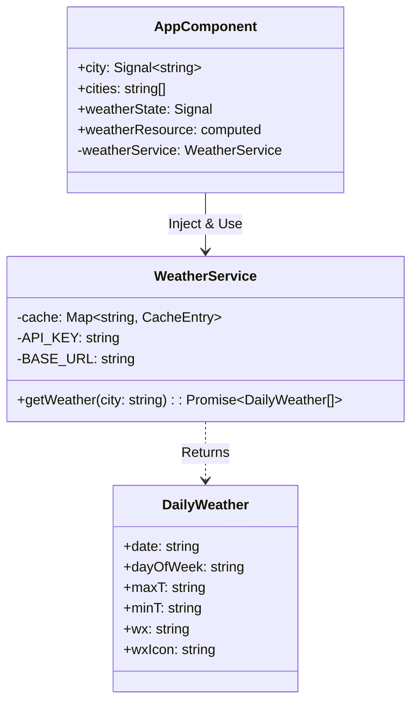
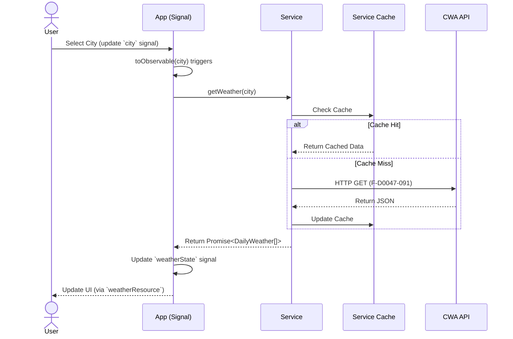

# Weather App Architecture Diagrams

## Class Diagram

```mermaid
classDiagram
    class DailyWeather {
        +date: string
        +dayOfWeek: string
        +maxT: string
        +minT: string
        +wx: string
        +wxIcon: string
    }

    class WeatherService {
        -cache: Map~string, CacheEntry~
        -API_KEY: string
        -BASE_URL: string
        +getWeather(city: string): Promise~DailyWeather[]~
    }

    class AppComponent {
        +city: Signal~string~
        +cities: string[]
        +weatherState: Signal
        +weatherResource: computed
        -weatherService: WeatherService
    }

    AppComponent --> WeatherService : Inject & Use
    WeatherService ..> DailyWeather : Returns
```

## Sequence Diagram

```mermaid
sequenceDiagram
    actor User
    participant AppComponent as App (Signal)
    participant WeatherService as Service
    participant Cache as Service Cache
    participant API as CWA API

    User->>AppComponent: Select City (update `city` signal)
    AppComponent->>AppComponent: toObservable(city) triggers
    AppComponent->>WeatherService: getWeather(city)
    
    WeatherService->>Cache: Check Cache
    alt Cache Hit
        Cache-->>WeatherService: Return Cached Data
    else Cache Miss
        WeatherService->>API: HTTP GET (F-D0047-091)
        API-->>WeatherService: Return JSON
        WeatherService->>Cache: Update Cache
    end
    
    WeatherService-->>AppComponent: Return Promise<DailyWeather[]>
    AppComponent->>AppComponent: Update `weatherState` signal
    AppComponent-->>User: Update UI (via `weatherResource`)
```
